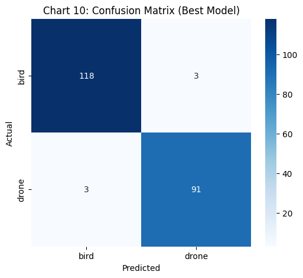
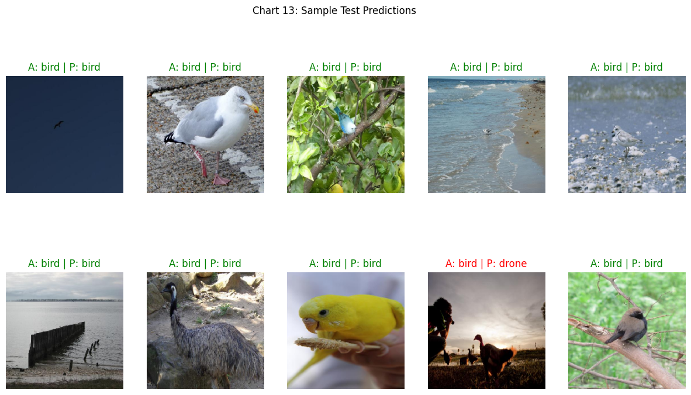

# 🚁 Aerial Object Classification AI (Bird vs. Drone)


## 📌 Project Overview
The rapid increase in drone usage has introduced significant challenges in airspace management, security surveillance, and wildlife protection. This deep learning project provides a robust computer vision solution capable of accurately differentiating between **Birds** and **Drones** in real-world aerial imagery.

Developed as a Master's Capstone Project (M.Sc. Data Science, MIT-WPU), this system features a high-accuracy image classification pipeline utilizing Transfer Learning (MobileNetV2) to deliver real-time inference.

---
## ✨ Key Features

- 🔍 Real-time aerial image classification (Bird vs Drone)
- 📸 Supports image upload and camera input
- ⚡ Fast inference using MobileNetV2
- 📊 Confidence scores with visual breakdown
- 🌐 Deployed on Streamlit Cloud
- 🧠 Transfer Learning-based architecture
---

## 🌐 Live Application
The classification model has been deployed as an interactive web application, allowing users to upload images or use live camera feeds for real-time inference.

🔗 **[Click Here to Try the Live Streamlit App](https://aerial-object-classification-jg7wa5b8ta49fpxpitqzhm.streamlit.app/)**

---

## 📂 Dataset Details
The dataset used to train the classification models is publicly available.

🔗 **[Download the Dataset (Google Drive)](https://drive.google.com/drive/folders/1nn1vqsh8juhafkJcleembrjQ9EqtIoMh?usp=drive_link)**
---
## ⚙️ Project Workflow

1. Data Preprocessing (Resizing, Normalization)
2. Data Augmentation (Rotation, Flipping, Zoom)
3. Model Building (Custom CNN & MobileNetV2)
4. Model Training with EarlyStopping
5. Model Evaluation (Accuracy, F1, Confusion Matrix)
6. Deployment using Streamlit 
---
### Classification Dataset (Binary: Bird / Drone)
Consists of standardized RGB images (`.jpg`) preprocessed to 224x224 pixels.
* **TRAIN set:** 1,414 Bird | 1,248 Drone
* **VALID set:** 217 Bird | 225 Drone
* **TEST set:** 121 Bird | 94 Drone

---

## 🧠 Methodology & Models

Two models were developed and compared to find the optimal balance of efficiency and accuracy:
1. **Custom CNN:** Built from scratch utilizing Batch Normalization, Dropout (0.5), and multiple convolutional blocks. Established a strong baseline of ~80.5% validation accuracy.
2. **Transfer Learning (MobileNetV2):** Leveraged frozen ImageNet weights with a custom Global Average Pooling head. This lightweight architecture drastically improved convergence, feature extraction, and real-world generalization.

---

## 🛠️ Tech Stack

- Python
- TensorFlow / Keras
- NumPy, OpenCV
- Matplotlib, Seaborn
- Streamlit

## 📊 Results & Conclusion

The **Transfer Learning (MobileNetV2)** architecture proved highly superior for this classification task, achieving an outstanding **97.21% accuracy on unseen test data**.

### Key Evaluation Metrics:
* **F1-Score Balance:** 0.97 for Drones, 0.98 for Birds (indicating zero class bias).
* **Confusion Matrix:** Only 6 misclassifications out of 215 test images.
* **ROC-AUC:** Perfect 1.00 area under the curve, proving exceptional class separability.

> ⚠️ Note: Model weights are not included in this repository due to size limitations.  
> The application uses pre-trained weights loaded during deployment.
## 📸 Sample Results

### 🔹 Confusion Matrix


### 🔹 Sample Predictions


### 🔹 Streamlit App UI
<p align="center">
  
  
  
</p>
**Conclusion:** This project successfully demonstrates that Transfer Learning architectures (like MobileNetV2) are highly viable for commercial security, aviation safety, and wildlife monitoring classification systems.

---
## 🔮 Future Scope

- Implement YOLOv8 for object detection (bounding boxes)
- Extend to real-time video detection
- Multi-class aerial object classification

## 🛠️ Local Installation & Usage

### 1. Clone the repository
```bash
git clone https://github.com/SourabhKhamankar22/Aerial-object-classification
cd Aerial-object-classifier
```

### 2. Create a virtual environment & install dependencies
```
conda create -n aerial_env python=3.10 -y
conda activate aerial_env
pip install -r requirements.txt
```

### 3. Run the Streamlit UI
```
streamlit run app.py
```

## 📁 Repository Structure
```
Aerial-object-classification/
├── assets/                                         # Images used in README (UI, results, etc.)
├── Aerial Object detection mobilenetv2.ipynb       # Training notebook (CNN + MobileNetV2)
├── app.py                                          # Streamlit web application
├── best_tl_model.h5                                # Saved Transfer Learning model (HDF5 format)
├── best_tl_model.keras                             # Saved model in Keras format
├── model.weights.h5                                # Lightweight model weights (used in deployment)
├── Report.pdf                                      # Project report documentation
├── requirements.txt                                # Dependencies for deployment
├── .gitignore                                      # Ignored files configuration
└── README.md                                       # Project documentation
```